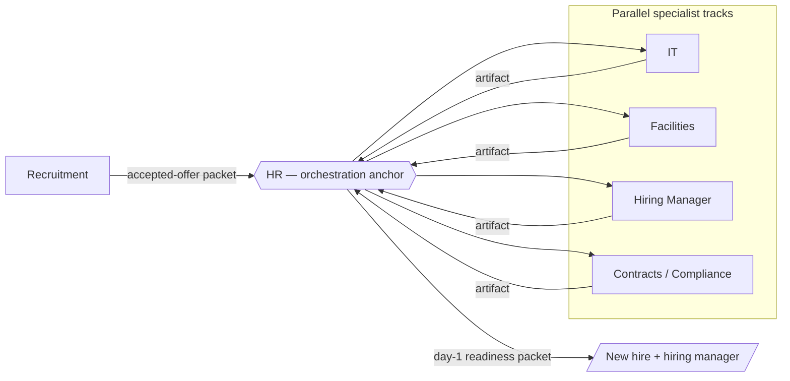

# Agent Ops Team

A working demonstration of **agentic architecture**: six specialized Claude Code agents, modeled on a real operations team, coordinating end-to-end on new-hire onboarding.

The team is built two ways from a single set of definitions — as a Claude Code **Agent Team** (experimental) and as stable **subagents**. Reviewers who can enable the experimental feature get the full team with inter-agent messaging; everyone else runs the same agents as subagents. No code changes between the two.

## Why this exists

Most "AI for ops" demos bolt a single assistant onto one person's workflow. Real operations work needs owners, defined handoffs, least-privilege data access, and an audit trail. This repo models that: named roles with written scope, every handoff routed through one coordinator, and guardrails grounded in a real [AI Governance Policy](#governance-grounding) — employment decisions stay with humans, regulated data is minimized, drafts are never auto-sent.

## The team

One orchestrator and five specialists. HR is the anchor; everything routes through it.

| Agent | Real ops function | Model | Role in onboarding |
|---|---|---|---|
| **HR** | HR / employee lifecycle | Sonnet | Orchestration anchor — opens the record, dispatches every track, synthesizes the result. The only agent with delegation authority. |
| **Recruitment** | Recruitment | Sonnet | Initiates — verifies the accepted offer and hands the packet to HR. |
| **IT** | IT / provisioning | Haiku | Laptop request + least-privilege account list. |
| **Facilities** | Facilities / workspace | Haiku | Desk assignment + badge request. |
| **Hiring Manager** | The new hire's line manager | Haiku | Welcome message + first-week orientation + team announcement. |
| **Contracts/Compliance** | Contracts & Compliance | Sonnet | Employment agreement + I-9 + policy-acknowledgment bundle. |

Sonnet is assigned to the three judgment-heavy roles (HR, Recruitment, Contracts/Compliance); Haiku runs the scoped, repeatable tracks. Definitions live in [`agents/`](agents/) (readable source) and are copied to [`.claude/agents/`](.claude/agents/) (the location Claude Code loads).

## Handoff diagram



The four specialist tracks run in parallel and each returns one structured artifact to HR. No specialist contacts another — single-coordinator design keeps the chain auditable. See [`workflows/onboarding.md`](workflows/onboarding.md) for the full sequence and [`demo/transcript.md`](demo/transcript.md) for a recorded run.

## How it runs

Both modes use the same definitions in `.claude/agents/`.

**Agent Teams (experimental).** Requires Claude Code v2.1.32+ and the enable flag in [`.claude/settings.json`](.claude/settings.json) (`CLAUDE_CODE_EXPERIMENTAL_AGENT_TEAMS=1`, already set). The session you start is the team lead and embodies HR; it spawns the other agents as teammates from their subagent types. The launch prompt is in [`workflows/onboarding.md`](workflows/onboarding.md).

**Subagent fallback (stable).** Works on any current Claude Code, no experimental features. The main session acts as HR and delegates each track to the matching subagent. (A subagent cannot spawn other subagents, so HR coordinates from the top level in this mode.)

Trigger input: [`demo/inputs/new-hire-form.json`](demo/inputs/new-hire-form.json).

## Repo structure

```
agent-ops-team/
├── README.md                     # this file
├── agents/                       # the six role definitions (readable source)
│   ├── hr.md  recruitment.md  it.md  facilities.md
│   ├── hiring-manager.md  contracts-compliance.md
│   └── _archive/                 # superseded definitions, retained (never deleted)
├── .claude/
│   ├── agents/                   # copy of the six — the location Claude Code loads
│   └── settings.json             # Agent Teams enable flag
├── workflows/
│   └── onboarding.md             # orchestration pattern, run modes, launch prompt
└── demo/
    ├── inputs/new-hire-form.json # sample trigger
    └── transcript.md             # recorded agent-by-agent run
```

## Design principles

Each agent definition enforces these; they are the conditions under which an automated ops team is allowed to operate.

- **Single-coordinator handoffs.** Specialists return to HR, never to one another. One auditable path.
- **Least-privilege — data and tools.** Each track receives only the fields it needs (IT and Facilities never see compensation or I-9 data); only HR holds delegation authority.
- **Human-in-the-loop for decisions.** Agents coordinate and assemble; a qualified human makes any decision that materially affects a person — hiring, offer terms, legal determinations.
- **Draft, don't send.** The Hiring Manager drafts the welcome and announcement; a human sends them.
- **Disclosure.** Where an agent generated a substantial part of a work product, it says so for the reviewing human.
- **Never delete.** Records are marked closed and retained for audit, never erased.

## Governance grounding

The guardrails above are drawn from a real organizational **AI Governance Policy**: employment-related AI is treated as high-risk (Recruitment does not screen or rank candidates); regulated personal data such as I-9 and background-check material is minimized and walled off from other tracks; AI use is disclosed; and a named human owns the outcome. The agents read like role charters written by a senior ops leader because the governance model they implement is a real one.

## Mapping notes

The agents map to functions on a real operations team, with two deliberate departures:

- **Recruitment** occupies the slot that was originally Travel & Expenses, which strengthens the onboarding handoff chain (an accepted offer is the natural trigger).
- **Hiring Manager** is a line role, not an ops-team function. A communications department drafting a new hire's welcome reads as invented; in practice the personal welcome, first-week orientation, and team announcement belong to the new hire's manager. It is included as a partner/participant in onboarding rather than a seventh ops function. (The original Communications definition is retained in [`agents/_archive/`](agents/_archive/).)

## Status

Agent Teams is experimental and disabled by default in Claude Code; this repo enables it via `.claude/settings.json` and targets v2.1.32+. The subagent mode has no such requirement and works on any current Claude Code.
